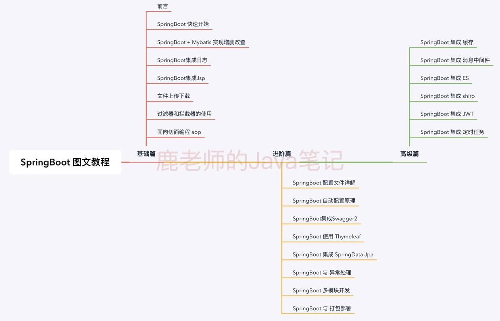

## 鹿老师的Java笔记

> 有天上飞的概念，就要有落地的实现
>
> - 概念+代码实现是本文的特点，教程将涵盖完整的图文教程，代码案例
> - 每个知识点配套自测面试题，学完技术自我测试
> - 本文初学向，所以希望文中所有的代码案例都能敲一遍
>
> 大哥大姐新年好，点赞转发不要少

从Java基础、JavaWeb基础、web常用框架、微服务以及大数据到面试技巧面试题，鹿老师将长期更新Java技术图文教程和视频教程，Java学习经验，Java面试经验以及Java实战开发经验。点击关注及时获取最新文章。

  
  

  
  
  

## **<a name="目录">:notebook:文章目录</a>**

### Java基础

#### JDK8 新特性

1. [什么？接口中方法可以不是抽象的「JDK8接口新语法的深度思考」](https://mp.weixin.qq.com/s/566y5AIEFjrti_sKX4JA1A)
2. 

### SpringBoot 图文教程 

1.  [SpringBoot图文教程1「概念+案例 思维导图」「基础篇上」](https://mp.weixin.qq.com/s/phk6j3ChBP-kPtS2xZeEZg)
2.  [SpringBoot图文教程2—日志的使用「logback」「log4j」](https://mp.weixin.qq.com/s/7Mw_xhFF4Q5NtdtcsHc67Q)
3.  [SpringBoot图文教程3—「‘初恋’情结」集成Jsp](https://mp.weixin.qq.com/s/BYzVg5NBcF_ou_PyX8ygag)
4.  [SpringBoot图文教程4—SpringBoot 实现文件上传下载](https://mp.weixin.qq.com/s/6ctykPo3eDBEB7YsC0PAZw)

### 日志使用 图文系列

1.  [「故事系列」小故事说清楚什么是日志框架](https://mp.weixin.qq.com/s/phk6j3ChBP-kPtS2xZeEZg)

### IDEA 的使用

1. [「硬核干货」总结IDEA开发的26个常用设置](https://mp.weixin.qq.com/s/PgGDi1krVtnSmb9UubKZJw)

### :cloud_with_lightning:<a name="面试题">面试题集锦</a>

### :medal_sports:<a name="公众号">鹿老师的公众号</a>

欢迎关注本人公众号：鹿老师的Java笔记，将在长期更新Java技术图文教程和视频教程，Java学习经验，Java面试经验以及Java实战开发经验。

